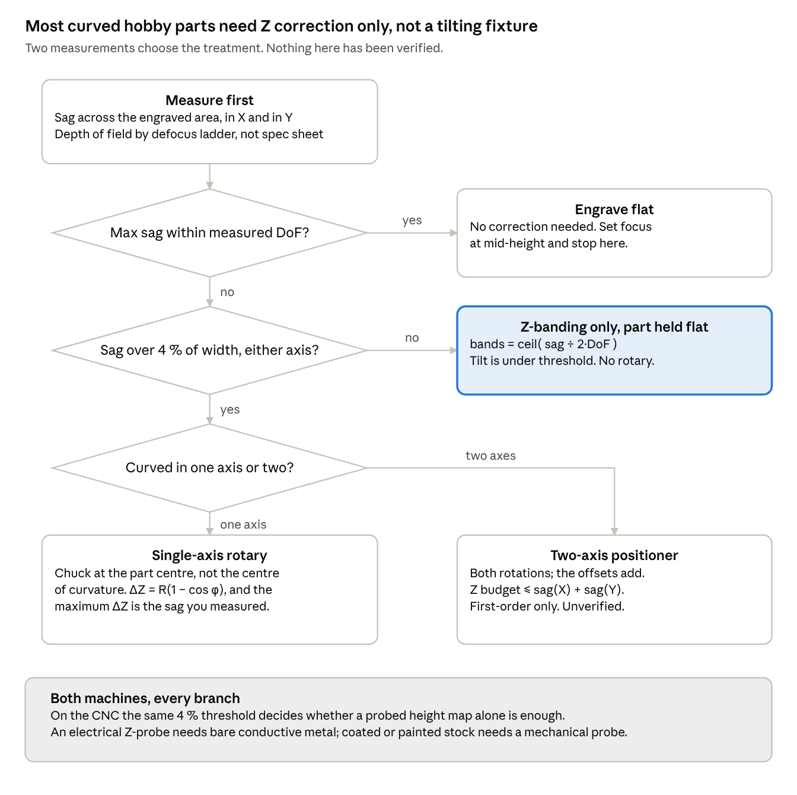

# Measuring Before Engraving

**Tilting a curved part back to perpendicular is almost always solving the wrong problem.**

## Is this your problem?

If you laser engrave or CNC carve metal and you have seen any of this:

- Lettering that is **crisp in the middle and blurry, fuzzy or faded at the ends** of a belt buckle, challenge coin, dog tag, tin lid, watch back, money clip or bracelet cuff
- A design that comes out **sharp in the centre and soft at the edges** on a part that looks perfectly flat
- Engraving that goes **shallow, grey, washed out or patchy** towards the outside of a slightly domed or dished surface
- Marks that are **out of focus at the ends** no matter how carefully you set focus on the middle
- A V-carve whose **groove walls look uneven** across a curved workpiece

…then your part is almost certainly not flat, and the cause is almost certainly **defocus, not tilt**. This repository works out which of five fixes you actually need, and how to measure it rather than guess.

## The short version

Hold a straight edge across an 80 mm brass belt buckle and the gap at the centre is about 1.5 mm. That curve tilts the surface by 4.3° at the ends, which stretches a focused laser spot by 0.3 %. The same 1.5 mm of defocus grows the spot to **2.5× its focused diameter** — a 150 % error. A fixture that tilts the part is chasing the smaller of those two by a factor of about five hundred.

Substitute the sagitta relation into the tilt angle and the geometry collapses to one ratio:

$$
\sin\theta_{\max} = \frac{4s}{w}
$$

Absolute size drops out. **Tilt is worth correcting only once sag exceeds roughly 4 % of the engraved width.** Belt buckles, challenge coins and tin lids are nowhere near. Spoons, bowls, bottle shoulders and ring interiors are.

> ### ⚠️ Nothing here has been measured
>
> This is version 0.1. Every figure is computed from geometry or quoted from a manufacturer specification, and every results table is blank on purpose. The three claims are stated so that a single afternoon of test coupons could falsify any of them. If you have a galvo laser and an hour, you can settle this — see [CONTRIBUTING.md](CONTRIBUTING.md).

## Read it

- **[PROTOCOL.md](PROTOCOL.md)** — the full thing: three findings, the measurement procedure, blank results tables, what would falsify each claim, and the bibliography.
- **[PDF](docs/Measuring-Before-Engraving-protocol.pdf)** / **[Word](docs/Measuring-Before-Engraving-protocol.docx)** — same content, for printing or attaching.

## What is actually new here

Three things, and the prior art is listed explicitly in the protocol so you can see where the line sits.

1. **Tilt is a red herring below 4 % sag-to-width.** We have not found this stated for hobby-scale parts, and it is the claim that saves someone the cost of a two-axis fixture.
2. **The Z correction equals the sag, exactly.** Chuck a part about its own centre rather than its centre of curvature and the Z offset needed at each rotation is $R(1 - \cos\varphi)$, whose maximum is the sagitta itself. The single measurement that characterises the part also bounds its own correction — no second measurement, no lookup table.
3. **Two measurements choose the method.** Sag in X, sag in Y, and a depth of field you *measured* select between five treatments. The value is less the logic than the comparability: two people who run it produce numbers that mean the same thing.

A fourth, which fell out of writing up the procedure and is the cheapest result in the document: **sag falls with the square of the span.** Shrinking a design from 80 mm to 56 mm takes the sag from 1.50 mm to 0.74 mm. Most people guess that saves 30 %; it saves half, and may put the part back inside focus with no fixture at all.

## Three fixes, cheapest first

1. **Make the design smaller.** Free. Sag falls with the square of the span, so it works about twice as well as people expect.
2. **Split the focus.** Free. Set focus halfway down the curve instead of on the crown, so nothing is more than half the sag out of focus.
3. **Engrave in Z bands.** Free but fiddly. Split the artwork into strips and drop Z between them: `bands = ceil( sag ÷ 2·DoF )`.

Only parts above the 4 % threshold need a rotary or a two-axis fixture. On the CNC, the same threshold decides whether a probed height map alone is sufficient.

## Why you cannot look the depth of field up

One vendor publishes spot diameters per lens; another publishes a depth of focus of 0.2 mm for a 26 µm spot. Those two figures scale as spot size squared — the physics is not in dispute — but they sit about **five times tighter** than the Rayleigh range the same spot implies. They are quoting different quantities, and neither is wrong.

A depth-of-field number without its criterion attached is not usable. The protocol therefore fixes the criterion — **the ± range over which mark width stays within 1.41× its minimum** — rather than leaving it to judgement.

## Scope

A flat-field two-axis galvo marking a part that does not move during the mark, or a three-axis router carving one. A machine with genuine dynamic three-axis focus solves this in hardware and needs none of it.

Developed against a WeCreat Lumos Ultra (MOPA and UV, interchangeable F-theta lenses, no dynamic focus) and a Genmitsu 3030-PROVer Ultra running GRBL, but nothing in the protocol depends on those machines.

## Contributing

The contribution this repository wants is **numbers**, not prose. Run the defocus ladder on your machine, open an issue with the nine values, and we will have something no single bench can produce. [CONTRIBUTING.md](CONTRIBUTING.md) has the procedure — it takes about an hour.

Corrections are just as welcome. If one of the three claims is wrong, the fastest path to a better document is someone saying so with a coupon.

## Citing and licence

The document is licensed [CC BY 4.0](LICENSE); any code added later is MIT. See [CITATION.cff](CITATION.cff), and keep the words *"unverified — no measurements taken"* in the citation until the tables have real numbers in them.

Developed in conversation between Lee Gillie and Claude (Anthropic). The contribution statement in [PROTOCOL.md](PROTOCOL.md#methods-collaboration-and-sources) says specifically which parts came from where.
